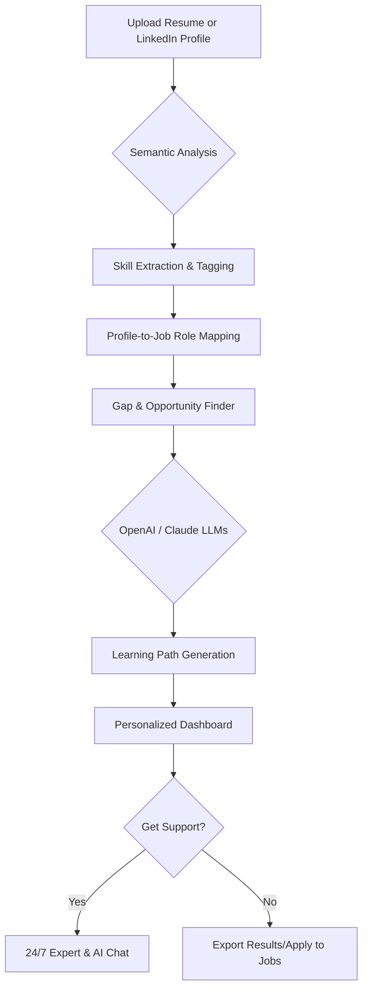

# QuantumCV-Insights 💼📊

> **An Intelligent Career Path Navigator Powered by Advanced Language Models & Semantic Analysis**

---

Welcome to **QuantumCV-Insights**, the next-generation career management toolkit designed for the ambitious, modern professional! Harnessing the prowess of OpenAI, Claude, and NLP innovations, this application does more than parse your resume: it illuminates your potential career trajectories, measures current skillsets, diagnoses learning gaps, and prescribes custom upskilling plans.

Dive into actionable insights, semantic job matching, and a responsive, intuitive interface with multilingual capabilities. Begin your transformation from job applicant to career architect—today.

---

## 🚀 Table of Contents
- [Quick Download](#quick-download)
- [What is QuantumCV-Insights? ☄️](#what-is-quantumcv-insights-)
- [Key Features 🎯](#key-features-)
- [How It Works — Mermaid Diagram 🌊](#how-it-works--mermaid-diagram-)
- [Example Profile Configuration 📝](#example-profile-configuration-)
- [Example Console Invocation 🖥️](#example-console-invocation-)
- [Platform Compatibility 🤖](#platform-compatibility-)
- [OpenAI & Claude API Integration 🤖🔗](#openai--claude-api-integration-)
- [Feature Highlights 🌟](#feature-highlights-)
- [License 📜](#license-)
- [Disclaimer ⚠️](#disclaimer-)
- [Get QuantumCV-Insights Now! 🚩](#get-quantumcv-insights-now-)

---

## 🎉 Quick Download
Begin your journey:

---

## What is QuantumCV-Insights? ☄️

**QuantumCV-Insights** is not just another resume parser. Think of it as a virtual compass for your career, using a tapestry of semantic analysis, large language models, and psychological mapping to chart your way forward. Upload your résumé or LinkedIn profile and engage with a dynamic dashboard that deciphers your competitive edge, recommends skill development, and matches you with futuristic job positions.

SEO-Optimized Description:  
Unlock your professional narrative and discover targeted paths to success with AI-powered resume interpretation, deep learning skill analysis, and global job-matching. QuantumCV-Insights puts your career growth at the center, leveraging intelligent algorithms for actionable and personalized insights.

---

## Key Features 🎯

- **Semantic Resume & Portfolio Analysis:**  
  Transcend keyword search—extract contextual, nuanced skill and experience mappings for every user.

- **AI-Enhanced Gap Diagnosis:**  
  Identify not just what skills you lack, but what you _should_ learn to unlock new roles.

- **Personalized Learning Path Generator:**  
  Get concrete, recommended upskilling modules and resources tailored to your goals.

- **Job Role Forecasting:**  
  See which positions are trending and how closely you align, based on global data and semantic profiles.

- **Responsive UI/UX:**  
  Enjoy a modern, intuitive frontend built with React and Streamlit, optimized for desktops, tablets, and mobile.

- **Multi-Platform/Multi-Language Support:**  
  Use QuantumCV-Insights in English, Spanish, German, Hindi, Mandarin, and more.

- **OpenAI & Claude API Integration:**  
  GPT-4 and Claude 3 power semantic mappings, content enrichment, and interactive job fit simulations.

- **Global Career Dataset:**  
  Leverage continuously updated industry benchmarks for more accurate insights.

- **24/7 Human-Assisted AI Support:**  
  Hybrid support: AI-driven responses with seamless handoff to human experts where necessary, anytime.

- **Privacy-First & Secure:**  
  All user files are encrypted and processed locally or via secure APIs. GDPR-ready.

---

## How It Works — Mermaid Diagram 🌊

---

## Example Profile Configuration 📝

Tailor your experience with a simple YAML or JSON file!

**profile_config.yaml**  
name: "Jordan Lee"
location: "New York"
target_roles:
  - "AI Product Manager"
  - "Machine Learning Engineer"
education_level: "Masters"
preferred_languages:
  - "English"
  - "Spanish"
highlight_goals:
  - "Rapid upskilling"
  - "Remote-first positions"
resume_file: "./samples/jordan_lee_resume.pdf"
api_keys:
  openai: "sk-xxxxxx"
  claude: "claude-xxxxxx"

---

## Example Console Invocation 🖥️

Pythonic & straightforward to run via command line!

$ quantumcv-insights analyze --config profile_config.yaml --export dashboard.html  

Or, launch the interactive UI:

$ quantumcv-insights dashboard

---

## Platform Compatibility 🤖

Here’s how QuantumCV-Insights supports your platform of choice:

| OS       | Native App | Web App  | Multilingual |
|----------|:----------:|:--------:|:------------:|
| 🪟  Windows |    ✅     |   ✅    |      ✅      |
| 🍎  MacOS   |    ✅     |   ✅    |      ✅      |
| 🐧  Linux   |    ✅     |   ✅    |      ✅      |
| 📱  iOS     |    🚧     |   ✅    |      ✅      |
| 🤖  Android |    🚧     |   ✅    |      ✅      |

_NOTE: Mobile native apps are in active development and planned for Q3 2026._

---

## OpenAI & Claude API Integration 🤖🔗

QuantumCV-Insights rides the vanguard of LLM technology. With seamless integration of OpenAI (incl. GPT-4, GPT-3.5) and Anthropic’s Claude 3, you get:

- Rich skill profiling and role-context understanding.
- Dynamic, in-line recommendations powered by real-time LLM querying.
- Enhanced conversational guidance—ask our chatbot _any_ career question!
- Support for user-uploaded API keys for full privacy and custom usage.

All API communications are secured with best-in-class encryption protocols.

---

## Feature Highlights 🌟

- 👁️‍🗨️ **Visualize Career Gaps:** Interactive graphics and heatmaps show you _exactly_ where you stand.
- 🌍 **Global Role Matching:** Connects you to job datasets spanning US, EU, and APAC regions.
- ☎️ **24/7 Customer Support:**  
  Promise: Wherever you are in your job journey, real help is never far.
- 🌐 **Multilingual Mastery:**  
  Enjoy auto-detection and translation, making it truly global.
- 📑 **Export Options:**  
  Output your custom development plan as PDF, CSV, or interactive web dashboards.
- 🛡️ **User-First Security**:  
  All computations on local devices by default. Cloud processing via opt-in.
- ⏳ **Active Roadmap:**  
  New features quarterly. Your feedback shapes what’s next!

---

## License 📜

Copyright (c) 2026

Licensed under the MIT License.  
See the [MIT LICENSE](https://opensource.org/licenses/MIT) for details.

---

## Disclaimer ⚠️

QuantumCV-Insights provides recommendations, suggestions, and educational guidance to aid professional development. Decisions made based on this analysis are ultimately the user’s responsibility. No guarantee of employment or interview is offered. Usage implies acceptance of our privacy terms and that third-party APIs adhere to their latest security practices.

---

## Get QuantumCV-Insights Now! 🚩

Ready to redefine your career journey?  
Download your QuantumCV-Insights package here:

Empower your career—one quantum leap at a time.

---